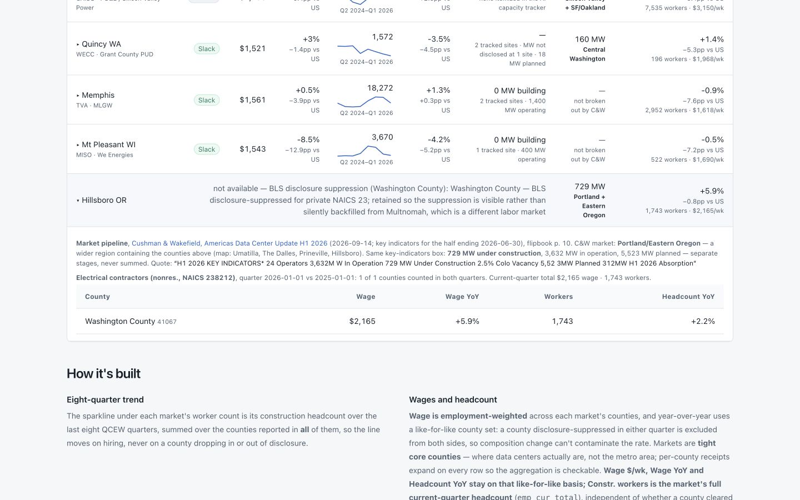

# PR #70 review — market construction pipeline

Reviewed October 7, 2026. PR: <https://github.com/ewyluda/macrogauge/pull/70>.

- Reviewed head: `bca5c27cbe30bd5b7a122ff8d5c17d1a389834b4`.
- Base: `d7e003e052ff48fee03b7bddaa98efb5eb20f443`.
- Scope: all 20 changed files, source/config attribution, loader validation,
  writer/schema integration, daily-publish failure isolation, sorting, and the
  built markets page. Quotes were checked against the committed C&W text layer;
  this review did not independently re-fetch the broker report or the report-only
  cross-check sources.
- Result: three P2 findings, ordered by impact below. All three are fixed in
  this review commit, with regression coverage. No P0/P1 finding established.

## F1 — P2: Reject malformed config before it escapes column isolation

**Original location:** `pipeline/dc_market_pipeline.py:143–144,162–163`, with the
column-only exception handler at `pipeline/run_daily.py:445–449`.

The loader called `.get()` on the JSON root and each market row without checking
that either was an object. A valid JSON file containing `null`, or a real config
whose first market is `null`, raised `AttributeError`. The new column's handler
does not catch that exception, so it escapes to the whole MARKETS phase: the
labor/electrical artifact is not published and `markets_ok` fails. This violates
the promised degradation to a null broker column while preserving labor data.

**Reproduction:** two fixture-only daily runs using those malformed files both
failed the regression assertion that `markets_ok` remains true. The original
test monkeypatched the loader to raise `ValueError`, so it did not cover actual
malformed JSON shapes.

**Fix:** validate the root and row object types and raise `ValueError` with a
specific message. Seven loader cases plus two end-to-end cases now pass, including
assertions that labor/electrical data is published and only the broker fields
are null.

## F2 — P2: Match the figure to its labeled MW measure in the quote

**Original location:** `pipeline/dc_market_pipeline.py:93–95,119–123`.

The receipt validator only searched for a number anywhere in the quotation.
Changing Virginia's construction value from 7,355 to its 12,338 operating MW
therefore passed. Swapping the two stages also passed, as did using the operator
count (64) or the `1` in its `1.0%` vacancy rate. The quote-to-page test still
passed because the quotation itself was unchanged. A curation error could thus
publish an incorrect construction ranking with a seemingly validated receipt.

**Fix:** require the value, MW unit, and its corresponding `Under Construction`
or `U/C`, `In Operation`, or `Planned` label together. Preserve support for the
source's split digits and `M W` spacing. All five wrong-measure regression cases
failed before the fix and now pass; the real config and its verbatim page quotes
also continue to pass. No current curated value was changed.

## F3 — P2: Keep source receipts reachable when construction labor is suppressed

**Original location:** `site/src/components/markets/MarketsClient.tsx:256–269`.

Hillsboro's NAICS 23 labor data is suppressed, so `Row` returned early with a
static, non-expandable row. The new independent broker cell showed 729 MW for
Portland/Eastern Oregon, but the user could not reach the source document,
flipbook page, quotation, map labels, or companion stage values that the PR
promises in the expanded receipt.

**Reproduction:** built the original UI with `dc_markets.json` regenerated from
the saved store/config. The new browser regression reached Hillsboro and timed
out waiting for its missing `button[aria-expanded]`; preceding geography,
sorting, Northern Virginia receipt, and desktop-width assertions passed.

**Fix:** give suppressed rows the same accessible toggle and an expanded row for
their independent broker/electrical receipts. The browser test opens and closes
the row with Enter and checks the source, page, and full quote. Manual inspection
also confirmed the result; at 1440px the expanded table's scroll/client widths
are both 1198px. At 375px document scroll/client widths are both 375px, with
horizontal scrolling confined to the table.

## Verification

- Original head: **1,251 Python tests** and **388 Vitest tests** passed.
- New regressions before fixes: **14 Python cases failed** and the browser
  receipt check failed, establishing that the existing green suites missed them.
- After fixes: `python -m pytest -q` — **1,265 passed**; `npm test` — **388 passed**;
  `npm run lint` and `npm run build` — passed.
- Full `npm run e2e` against the regenerated markets artifact — **227 passed,
  3 skipped**. The new column and Hillsboro checks ran. The remaining skips are
  existing publication gates for long-lead times, capacity EV/MW exclusions,
  and alternate build-input changes.
- The temporary markets artifact was restored byte-for-byte before commit.
  No published JSON, config figures, or append-only store partitions are changed.
- Final build with the original committed artifact: passed. Markets smoke checks
  (`npm run e2e -- --grep 'markets|/markets'`): **7 passed, 2 skipped**. Both skips
  correctly reflect that this older artifact lacks the broker column and trend
  history; both tests ran and passed in the full regenerated-artifact suite.
